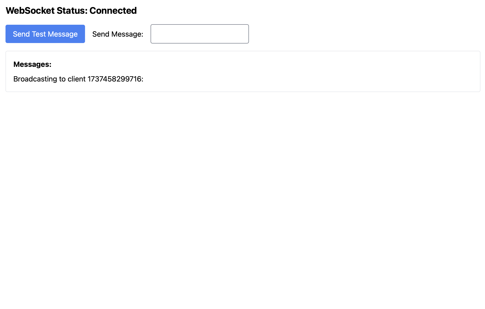
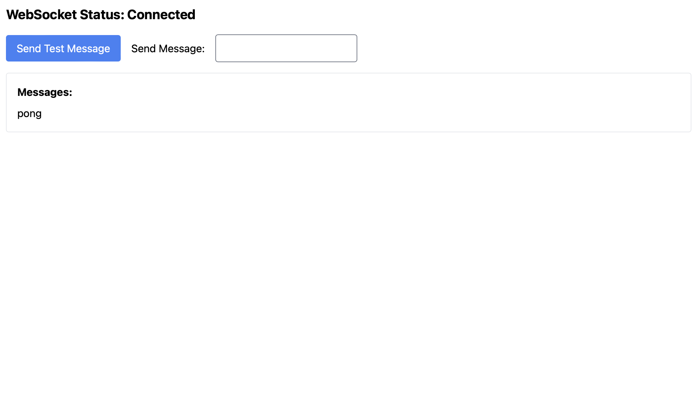

# Web Socket with Heartbeat Example

> This is a simple example of using WebSocket with heartbeat to keep the connection alive.

## Stack

### Frontend

- React + Vite
- Tailwind CSS

### Backend

- Node.js
- Express
- WebSocket

#### Features

1. **WebSocket**: The server will echo the message back to the client in `ws://localhost:3000`



2. **Heartbeat**: If user sends a `ping` message, the server will respond with a `pong` message.



## Start With Docker

```bash
docker compose build
docker compose up -d // Start with detach mode
```

## Reference

1. [Writing WebSocket servers](https://developer.mozilla.org/en-US/docs/Web/API/WebSockets_API/Writing_WebSocket_servers#pings_and_pongs_the_heartbeat_of_websockets)
